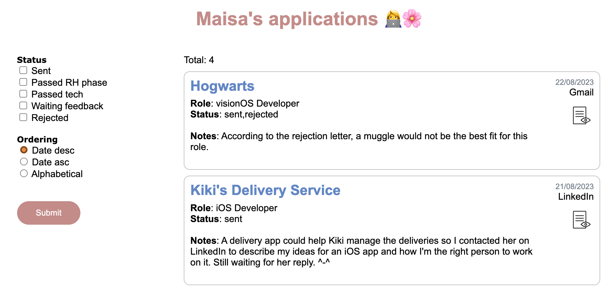

# Job Application Manager

- Manage your job applications in a `.json` file
- Filter and order them
- Write personal notes about it
- Check out the resume sent in the application
- Keep track of where and when the application was submitted



The project is organized as:
- `public folder`: frontend
- `resume`: storage for resumes' `.pdf`
- `data.json`: "database"
- `server.js`: backend

## 💻 Pre-requirements
To run the application you will need:
- [Node.js](https://nodejs.org/en/download/package-manager)

## 🚀 Running
From the root folder:
```
npm i
node server.js
```
Then, on your browser, go to `http://localhost:3000/`

## 🧙‍♀️ Create your won Job Application Manager 
Download the project and add it to your own private repository. If you fork it, you won't be able to change its visibility to private.

Update the `data.json` with your data, create your own filters, and update the style to match your preferences.

## 😄 Contributions
The idea of this project is to keep it very simple, only using HTML and pure JavaScript for the UI with a simple server.

Contributions following these principles can be made through Pull Requests.

## 📝 License
Under MIT license. Check on [LICENSE](LICENSE) for details.
